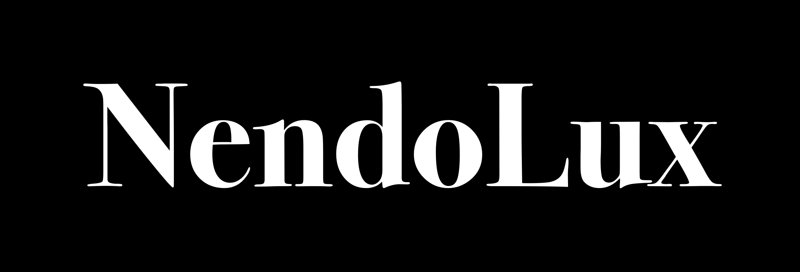

# 
## Despliegues
[NendoLux Firebase deploy](https://nendolux.web.app/)
## Acerca de NendoLux
<table>
  <tr>
    <td></td>
    <td style="vertical-align: top;">NendoLux es una empresa de e-commerce especializada en la venta de Nendoroids de lujo, ofreciendo figuras de alta calidad para coleccionistas y fanáticos. Su enfoque está en brindar una experiencia premium, tanto en productos como en servicio al cliente.</td>
  </tr>
</table>

## Actividades de los implicados
### Víctor "Kaseem" Chavarría
- App Design.
- App Scheme.
- Imagotype and Isotype Design.
- General Poster Design.
- Collection Poster Design.
- Navbar.
- Navbar Imagotype Animation.
- Mobile Format Adaptation.
- Web Format Adaptation.
- Mockup Package NendoLux.
- Legal Terms.
- GitHub Pages app deployment.
- SearchBar.
- HTML docs optimization.
- JSONs.
- Icons.
- Call of the night docs optimization web / mobile.
- Chainsaw Man docs optimization web / mobile.
- Kaguya Sama docs optimization web / mobile.
- Kamikatsu docs optimization web / mobile.
- Kimetsu No Yaiba docs optimization web / mobile.
- Kobayashi's Dragon Maid docs optimization web / mobile.
- Persona 3 docs optimization web / mobile.
- Persona 5 docs optimization web / mobile.
- Persona 5 Royal docs optimization web / mobile.
- Tomo Chan Is A Girl docs optimization web / mobile.
- Cart.
- Auth Views.
- Cart Views.
- Firebase app deployment.
- Buy View.
- Optimization.
- Email Auth.
- Google Auth.
- UX / UI.

### Samuel "Tiburocin" Gutierrez
- Payment Geteway.

### Jonathan "Zniver" Zavala
-  Shipping Calculator.